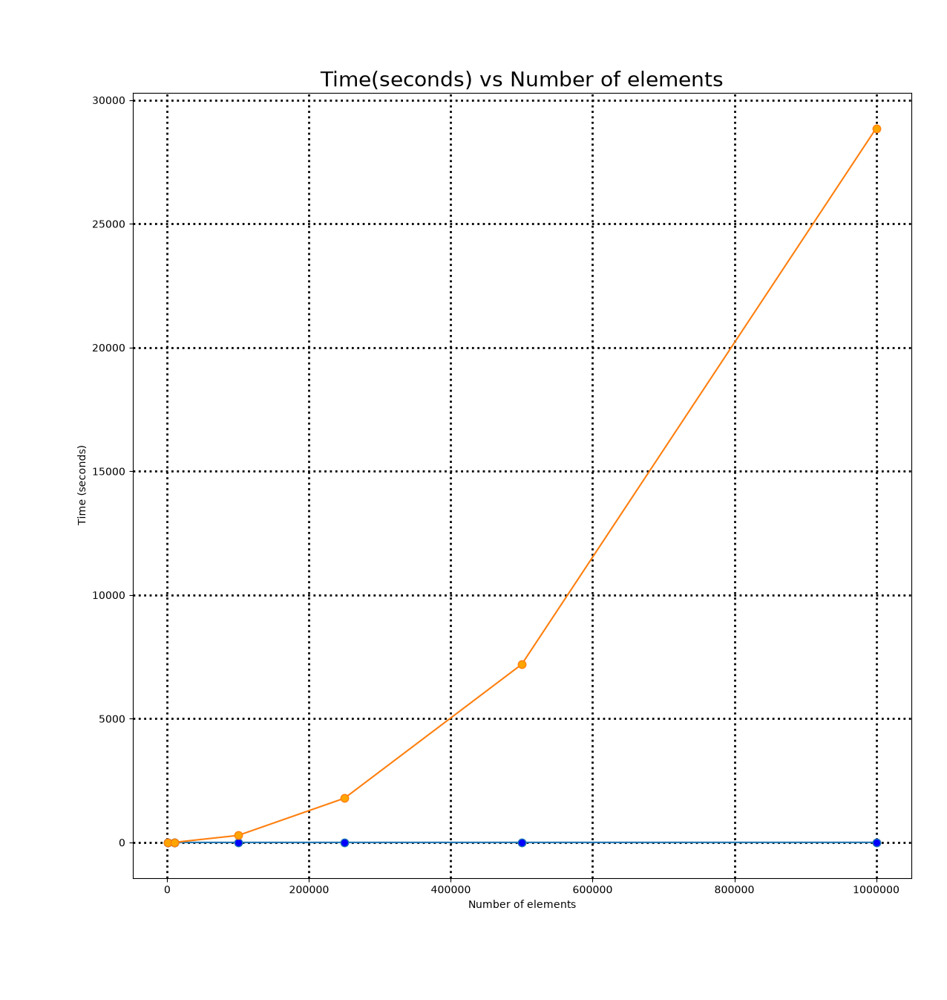

# Everything hw2 part 3 is here or you can go to its markdown

## Student Information

- **Name:** Brycen Anderson
- **Student ID:** 111017061
- **Class:** CSCI 3412-001 — Algorithms
- **Homework #:** HW2
- **Due Date:** September 28, 2026

---

## Problem Solving

Everything part 1,2,3,4 are in the html page.

[HTML page](BrycenAnderson.html)
[PDF file](Part1.pdf)

```HTML
<!DOCTYPE>
<html lang="en">
    <head>
        <meta charset="UTF-8">
        <meta name="viewport" content="width=device-width, initial-scale=1.0">
        <meta name="author" content="Brycen Anderson">
        <link rel="icon" type="image/png" href="">
        <link rel="stylesheet" href="page.css">
        <title>BrycenAnderson.hw2</title>
    </head>
    <body>
        <h2 align="center">Brycen Anderson Problem 1.1</h2>
        <div>
                
            
            <table border="1" style="background-color:light-blue" align="center">
                <tr>
                    <th></th>
                    <th>second</th>
                    <th>minute</th>
                    <th>hour</th>
                    <th>day</th>
                    <th>month</th>
                    <th>year</th>
                    <th>century</th>
                </tr>
    
                <tr>
                    <td>lg n</td>
                    <td>2<sup>1,000,000</sup></td>
                    <td>2<sup>60,000,000</sup></td>
                    <td>2<sup>3,600,000,000</sup></td>
                    <td>2<sup>86,400,000,000</sup></td>
                    <td>2<sup>2,592,000,000,000</sup></td>
                    <td>2<sup>31,536,000,000,000</sup></td>
                    <td>2<sup>3,153,600,000,000,000</sup></td>
                </tr>
                
                <tr>
                    <td>√n</td>
                    <td>10<sup>12</sup></td>
                    <td>3.6 X 10<sup>15</sup></td>
                    <td>1.296 X 10<sup>19</sup></td>
                    <td>7.46496 X 10<sup>21</sup></td>
                    <td>6.718464 X 10<sup>24</sup></td>
                    <td>9.94519296 X 10<sup>26</sup></td>
                    <td>9.94519296 X 10<sup>30</sup></td>
                </tr>

                <tr>
                    <td>n</td>
                    <td>1,000,000</td>
                    <td>60,000,000</td>
                    <td>3,600,000,000</td>
                    <td>86,400,000,000</td>
                    <td>2,592,000,000,000</td>
                    <td>31,536,000,000,000</td>
                    <td>3,153,600,000,000,000</td>
                </tr>

                <tr>
                    <td>n lg n</td>
                    <td>62,746</td>
                    <td>2,801,417</td>
                    <td>133,378,058</td>
                    <td>2,755,147,513</td>
                    <td>71,870,856,404</td>
                    <td>797,633,893,349</td>
                    <td>68,610,956,750,570</td>
                </tr>

                <tr>
                    <td>n<sup>2</sup></td>
                    <td>1,000</td>
                    <td>7,745</td>
                    <td>60,000</td>
                    <td>283,938</td>
                    <td>1,609,968</td>
                    <td>5,615,692</td>
                    <td>56,156,922</td>
                </tr>

                <tr>
                    <td>n<sup>3</sup></td>
                    <td>100</td>
                    <td>391</td>
                    <td>1,532</td>
                    <td>4,420</td>
                    <td>13,736</td>
                    <td>31,593</td>
                    <td>146,645</td>
                </tr>

                <tr>
                    <td>2<sup>n</sup></td>
                    <td>19</td>
                    <td>25</td>
                    <td>31</td>
                    <td>36</td>
                    <td>41</td>
                    <td>44</td>
                    <td>51</td>
                </tr>

                <tr>
                    <td>n!</td>
                    <td>9</td>
                    <td>11</td>
                    <td>12</td>
                    <td>13</td>
                    <td>15</td>
                    <td>16</td>
                    <td>17</td>
                </tr>
                </table>
            </div>
        <div align="center" width="70%">
            <h3>Part 1.2, 1.3</h3>
            <object data="Algorithms.pdf" type="application/pdf" width="70%" height="100%"></object>
        </div>
        <div><h3 align="center">Part 1.4</h3>
            <p width="80%"> If I were the lead software development architect at the IRS, I would make a system that compares how much money people report earnings with how much they spend. If they spend more than they earn, the system would flag it for review. Since the extra money could come from savings, loans, or gifts it would need to be checked before assuming they hid income.</p>
        </div>
    </body>
</html>
```

```css
table{
    border:1;
    width: 100%;
    table-layout: fixed; 
}

th{
    background-color:lightgrey;
}

```

### Problem 1 output

## Time efficiency between good and not-so-good sorting algorithms

### insertion and merge sort

#### Insertion sort

```python
    #sort array starting with 2 elements then do with 3 so on so forth till at n-1 elements 
    def insertionSort(arr):
        global insertcomp
        for i in range(1,len(arr)):
            j = i - 1
            while j >= 0 and arr[j+1] < arr[j]:
                insertcomp += 1 
                arr[j+1],arr[j] = arr[j],arr[j+1]
                j -= 1
        return arr
```

##### insertion Output

```shell
Function Name: insertionSort
Comparisons: 247366
Real Time:26.614 ms
OutPut

Function Name: insertionSort
Comparisons: 24992745
Real Time:2.713 seconds
OutPut

Function Name: insertionSort
Comparisons: 2505319309
Real Time:283.117 seconds
OutPut

Function Name: insertionSort
Comparisons: 15645054948
Real Time:1787.161 seconds
OutPut

Function Name: insertionSort
Comparisons: 62476143445
Real Time:7196.722 seconds
OutPut

Function Name: insertionSort
Comparisons: 249926868099
Real Time:28860.169 seconds
OutPut
```

###### insertion Sort analysis

As the datasets grew, insertion sort became much slower, taking about 8 hours for 1 million elements. This matches its O(n^2) average time complexity.

#### merge sort

##### split

```python
    #break into smaller and smaller slices till 1 element
    def mergeSort(arr,s,e):
        if e-s + 1 <= 1:
            return arr

        m = (s + e) //2 
        mergeSort(arr,s,m)
        mergeSort(arr,m+1,e)
        merge(arr,s,m,e)

        return arr
```

##### merge

```python
    #merge elements from 2 arrays back into 1 
    def merge(arr, s, m, e):
        global mergecomp
        l = arr[s:m +1]
        r = arr[m+1:e+1]
        i,j,k = 0,0,s
        
        while i< len(l) and j < len(r):
            mergecomp += 1
            if l[i] <= r[j]:
                arr[k] = l[i]
                i +=1
            else: 
                arr[k] = r[j]
                j += 1
            k += 1
        
        while i < len(l):
            arr[k] = l[i]
            i += 1
            k += 1

        while j < len(r):
            arr[k] = r[j]
            j += 1
            k += 1

```

##### merge Output

```shell
Function Name: mergeSort
Comparisons: 8693
Real Time:1.345 ms
OutPut

Function Name: mergeSort
Comparisons: 120490
Real Time:16.811 ms
OutPut

Function Name: mergeSort
Comparisons: 1536145
Real Time:196.399 ms
OutPut

Function Name: mergeSort
Comparisons: 4168476
Real Time:522.499 ms
OutPut

Function Name: mergeSort
Comparisons: 8836722
Real Time:1.100 seconds
OutPut

Function Name: mergeSort
Comparisons: 18673567
Real Time:2.331 seconds
OutPut
```

###### merge Sort analysis

Merge sort
was faster on every dataset, taking only 2.331 seconds for 1 million elements.
Its O(n log n) time complexity makes it more efficient for large datasets.

### graph

```python
    #plot the points and map 
    def plot():
        size = [1000,10000,100000,250000,500000,1000000]
        
        plt.plot(size,mergetime,label="merge Sort" ,marker=".",ms=15,markerfacecolor="blue")
        plt.plot(size,inserttime,label="insertion Sort",marker=".",ms=15,markerfacecolor="orange")
        
        plt.title("Time(seconds) vs Number of elements",fontsize=20)
        plt.ylabel("Time (seconds)")
        plt.xlabel("Number of elements")
        
        plt.grid(axis="both",linewidth=2,color="black",linestyle="dotted")
        plt.show()

```



### full main

```python

import time
import random
import matplotlib.pyplot as plt

insertcomp,mergecomp = 0,0
mergetime = []
inserttime = []

#plot the points and map 
def plot():
    size = [1000,10000,100000,250000,500000,1000000]
    plt.plot(size,mergetime,label="merge Sort" ,marker=".",ms=15,markerfacecolor="blue")
    plt.plot(size,inserttime,label="insertion Sort",marker=".",ms=15,markerfacecolor="orange")
    
    plt.title("Time(seconds) vs Number of elements",fontsize=20)
    plt.ticklabel_format(axis="x",style="plain",useOffset=False)
    plt.ylabel("Time (seconds)")
    plt.xlabel("Number of elements")
    plt.tight_layout()
    plt.grid(axis="both",linewidth=2,color="black",linestyle="dotted")
    plt.show()

def timeEfficiency(funcName, *args,**keys):
    start = time.perf_counter_ns()
    result = funcName(*args,**keys)
    end = time.perf_counter_ns()
    elapsed = end - start
    took = ""
    
    if(funcName.__name__ == "mergeSort"):
        comp = mergecomp
        mergetime.append(elapsed/1000000000)
    else:
        comp = insertcomp
        inserttime.append(elapsed/1000000000)
    
    if elapsed >= 1000000000:
        took = f"{elapsed/1000000000:.3f} seconds"
    elif elapsed >= 1000000:
        took = f"{elapsed / 1000000:.3f} ms"
    else:
        took = f"{elapsed} ns" 
    
    return "Function Name: " + str(funcName.__name__) + f"\nComparisons: {comp}" + "\nReal Time:" + took + "\nOutPut\n" + str(result)  

#break into smaller and smaller slices till 1 element
def mergeSort(arr,s,e):
    if e-s + 1 <= 1:
        return arr

    m = (s + e) //2 
    mergeSort(arr,s,m)
    mergeSort(arr,m+1,e)
    merge(arr,s,m,e)

    return arr

#merge elements from 2 arrays back into 1 
def merge(arr, s, m, e):
    global mergecomp
    l = arr[s:m +1]
    r = arr[m+1:e+1]
    i,j,k = 0,0,s
    
    while i< len(l) and j < len(r):
        mergecomp += 1
        if l[i] <= r[j]:
            arr[k] = l[i]
            i +=1
        else: 
            arr[k] = r[j]
            j += 1
        k += 1
    
    while i < len(l):
        arr[k] = l[i]
        i += 1
        k += 1

    while j < len(r):
        arr[k] = r[j]
        j += 1
        k += 1

#sort array starting with 2 elements then do with 3 so on so forth till at n-1 elements 
def insertionSort(arr):
    global insertcomp
    for i in range(1,len(arr)):
        j = i - 1
        while j >= 0:
            insertcomp += 1 
            if arr[j+1] >= arr[j]:
                break
            arr[j+1],arr[j] = arr[j],arr[j+1]
            j -= 1
    return arr

#yay python 
def arrayNeededIAmlazy(low,high,number):
    return [random.randint(low,high) for _ in range(number)]

def main():
    #arr = arrayNeededIAmlazy(int(input("lowest number: ")),int(input("largest number: ")),int(input("Total size: ")))
    global mergecomp, insertcomp
    fileNames = ["rand1000.txt","rand10000.txt","rand100000.txt","rand250000.txt","rand500000.txt","rand1000000.txt"]
    for name in fileNames:
        with open(name,"r") as file:
            arr = [int(value) for value in file.read().split()]
            mergecomp,insertcomp = 0,0
            print(timeEfficiency(mergeSort,arr.copy(),0,len(arr)-1))
            print(timeEfficiency(insertionSort,arr.copy()))
            if input("Look at output Enter when done and it will go to the next q to quit-> ") == 'q':
               break
    plot()
if __name__ == "__main__":
    main()
```

### full output

```shell
Function Name: mergeSort
Comparisons: 8693
Real Time:1.345 ms
OutPut

Function Name: insertionSort
Comparisons: 247366
Real Time:26.614 ms
OutPut

Function Name: mergeSort
Comparisons: 120490
Real Time:16.811 ms
OutPut

Function Name: insertionSort
Comparisons: 24992745
Real Time:2.713 seconds
OutPut

Function Name: mergeSort
Comparisons: 1536145
Real Time:196.399 ms
OutPut

Function Name: insertionSort
Comparisons: 2505319309
Real Time:283.117 seconds
OutPut

Function Name: mergeSort
Comparisons: 4168476
Real Time:522.499 ms
OutPut

Function Name: insertionSort
Comparisons: 15645054948
Real Time:1787.161 seconds
OutPut

Function Name: mergeSort
Comparisons: 8836722
Real Time:1.100 seconds
OutPut

Function Name: insertionSort
Comparisons: 62476143445
Real Time:7196.722 seconds
OutPut

Function Name: mergeSort
Comparisons: 18673567
Real Time:2.331 seconds
OutPut

Function Name: insertionSort
Comparisons: 249926868099
Real Time:28860.169 seconds
OutPut
```

## Loop Invariant Proof - Dutch National Flag Algorithms

### What is loop invariant proof

A loop invariant proof state that for every nth loop the loop will stay true and
will produce the correct result at the end. So starts, true stays true, ends true.

### Iterations

Before low is 0
Low through mid - 1 is 1
From mid - high is not checked
after high is 2

### Initially

Low = 0
Mid = 0
High = len(nums) - 1
nothing has been checked so the array is sorted/unchecked.

### 3 cases

#### case 1

If nums at position mid equals 0 swap nums at position low and nums at position
high.Increment low and mid.

#### case 2

If nums at position mid equals 1 Increment mid

#### case 3

If nums at position mid equals 2 swap nums at position high and nums at position
mid decrement high.

### Termination

(int pointers in neetcode/leetcode all the time so i think its ok)
If the pointer mid is past high pointer then terminate the loop.
